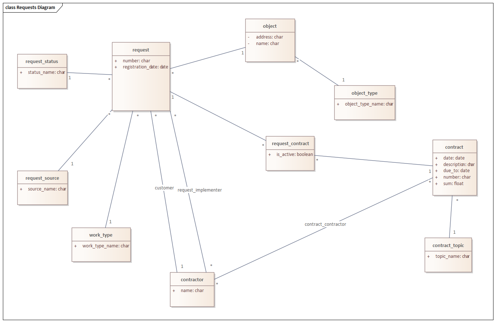
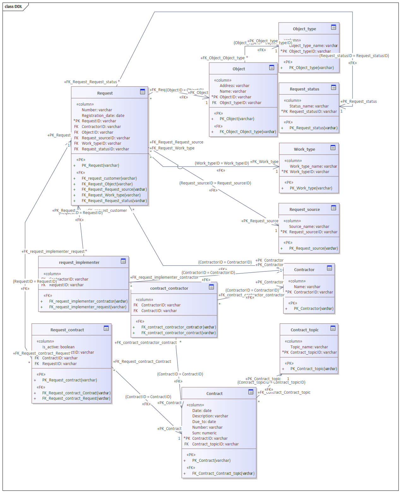

# Тестовое задание на позицию системного аналитика
[Текст задания](./0-test-task/task.md)

## Решение
Задание состоит из двух частей:
- Проектирование логической модели и написание трех SQL-запросов
- Проектирование архитектуры сервиса, реализующего бизнес-требование

Вначале спроектируем логическую модель БД. На ее основе можно автоматически сгенерировать физическую модель и DDL-скрипты для соответсвующей БД. Для этого будем использовать функциональность ПО Enterprise Architect. В качестве РСУБД используем Postgresql.

### Модель и SQL-запросы
[Исходник UML-диаграммы](./1-logical-model/requests.xmi)

Логическая модель

Физическая модель. В качестве упрощения предположим, что первичные ключи для всех сущностей в системе суррогатные (хотя, как минимум, для заявок и договоров первичный ключ может быть натуральным).

[DDL-скрипты](./3-pgsql-ddl-scripts/ddl.sql)

[SQL-скрипт 1](./4-scripts-task/1.sql)

[SQL-скрипт 2](./4-scripts-task/2.sql)

[SQL-скрипт 3](./4-scripts-task/3.sql)

### Архитектура сервиса

В задании сказано, что система представляет собой веб-приложение, реализованное на основании REST API с использованием микросервисной архитектуры. Примем, что функциональность, соответствующая бизнес-требованиям по работе с заявками и договорами,будет реализована в одном сервисе. Вариант реализации функциональности работы с заявками и договорами в отдельных микросервисах на данном этапе не рассматриваем.

В качестве архитектуры сервиса заявок допустимо использовать стандартный паттерн layered architecture, состоящий из следующих уровней:
- Уровень контроллеров \- содержить обработчики REST API методов, соответствующих бизнес-требованиям
- Сервисный уровень \- содержит логику обработки внешних запросов
- Уровень доступа к РСУБД (уровень репозиториев), инкапсулирующий в себе логику работы с БД

#### Уровень контроллеров

Определения методов контроллеров можно сформировать автоматически, если описать бизнес-функциями в стандарте OAS. [Усеченный вариант реализации OAS 3.0](./5-architecture/requests-api.yaml) под заданные бизнес-функции.

#### Сервисный уровень

Реализуется разработчиками сервиса. Объектную модель (классы) можно сформировать на основе логической модели, представленной ранее.

#### Уровень доступа к БД

Реализуется разработчиками сервиса. Схема БД представлена ранее в виде физической модели.
